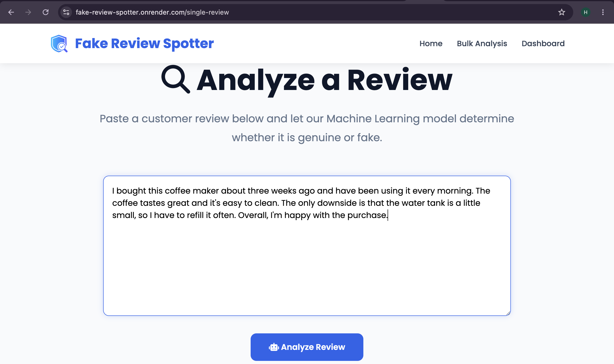
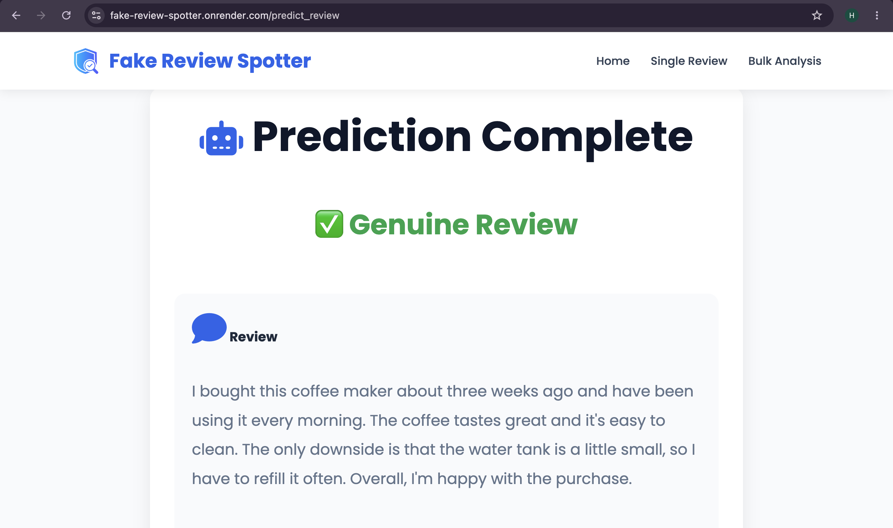
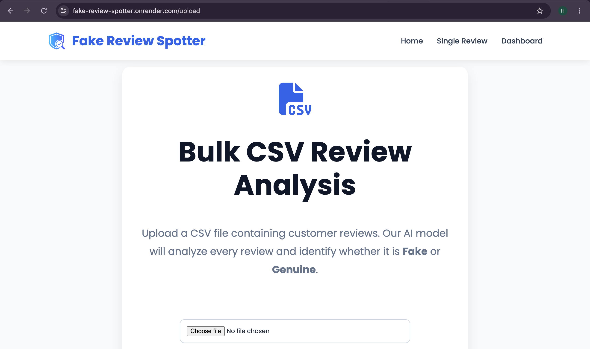
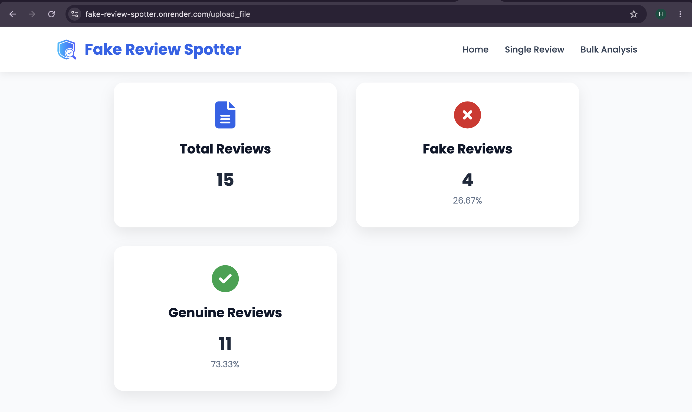
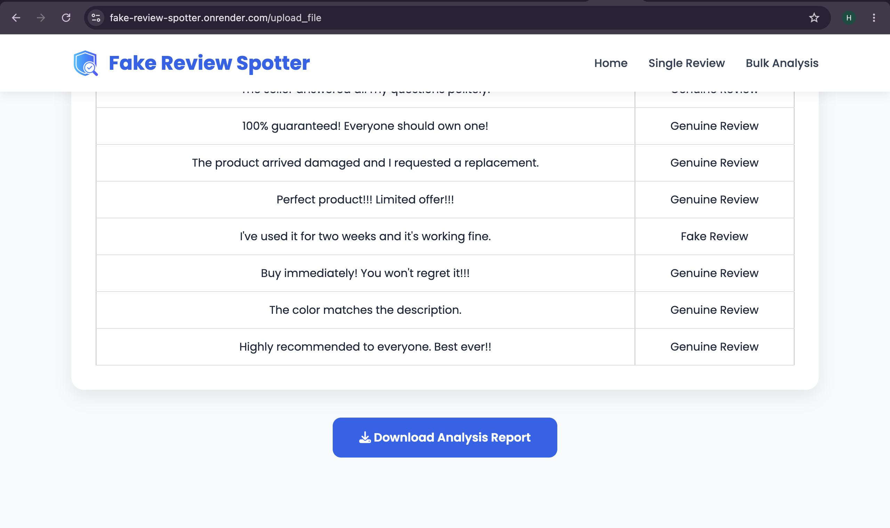
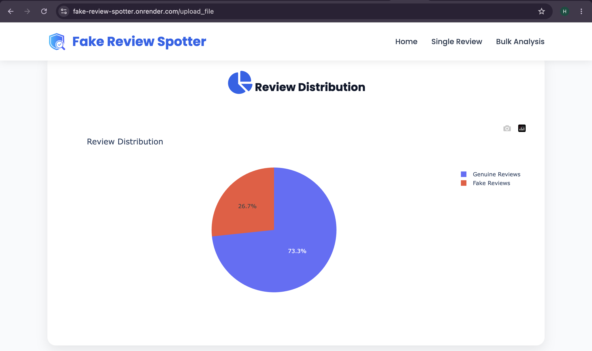

# 🤖 Fake Review Spotter

An AI-powered web application that detects whether customer reviews are **Fake** or **Genuine** using **Natural Language Processing (NLP)** and **Machine Learning**.

---

## 🌐 Live Demo

**Render Deployment:**  
https://fake-review-spotter.onrender.com

---

## 📌 Project Overview

Fake online reviews can significantly influence customer purchasing decisions and reduce trust in e-commerce platforms. This project uses **Natural Language Processing (NLP)** and **Machine Learning** to automatically classify customer reviews as **Fake** or **Genuine**.

The application provides both **single review analysis** and **bulk CSV review analysis**, along with interactive visualizations and downloadable prediction reports.

---

## ✨ Features

- 🔍 Analyze individual customer reviews
- 📂 Upload CSV files for bulk review analysis
- 🤖 Detect Fake and Genuine reviews using Machine Learning
- 📊 Interactive dashboard with review statistics
- 🥧 Pie chart visualization using Plotly
- 📥 Download prediction results as a CSV report
- 🧹 NLP preprocessing (stopword removal & lemmatization)
- 📱 Responsive and user-friendly interface built with Flask

---

# 📷 Project Screenshots

## 🏠 Home Page


---

## 🔍 Single Review Analysis



---

## ✅ Prediction Result



---

## 📂 Bulk CSV Upload



---

## 📊 Bulk Analysis Dashboard



---

## 📥 Download Report



---

## 📈 Review Distribution



---

## 📊 Project Dashboard

.png)

.png)

.png)

---

## 🛠 Tech Stack

### Programming Language
- Python

### Backend
- Flask

### Frontend
- HTML5
- CSS3

### Machine Learning
- Scikit-learn
- Linear Support Vector Machine (Linear SVM)
- TF-IDF Vectorizer

### Natural Language Processing
- NLTK
- Stopword Removal
- Lemmatization

### Data Processing
- Pandas
- NumPy

### Data Visualization
- Plotly

### Model Storage
- Joblib

---

## 📂 Dataset

The machine learning model was trained using two publicly available datasets:

- **Amazon Fake Review Dataset**
- **Deceptive Opinion Spam (Hotel Reviews) Dataset**

Both datasets were merged, cleaned, preprocessed, and balanced before training the model.

---

## ⚙️ Machine Learning Workflow

1. Load datasets
2. Merge datasets
3. Clean review text
4. Remove stopwords
5. Perform lemmatization
6. Convert text using TF-IDF Vectorization
7. Split dataset into training and testing sets
8. Train the Linear SVM classifier
9. Evaluate model performance
10. Save the trained model using Joblib
11. Deploy the model using Flask

---

## 📈 Model Performance

| Metric | Value |
|---------|-------|
| Algorithm | Linear Support Vector Machine (Linear SVM) |
| Feature Extraction | TF-IDF Vectorizer |
| NLP Library | NLTK |
| Accuracy | ~90% |

---

## 📁 Project Structure

```text
Fake-Review-Spotter/
│
├── app.py
├── requirements.txt
├── README.md
├── trained_model/
│   ├── review_model_v2.pkl
│   ├── tfidf_vectorizer_v2.pkl
│   └── label_encoder.pkl
│
├── templates/
│   ├── index.html
│   ├── single_review.html
│   ├── result.html
│   ├── upload.html
│   ├── bulk_result.html
│   └── dashboard.html
│
├── static/
│   ├── css/
│   │   └── style.css
│   └── images/
│       └── favicon.png
│
├── uploads/
├── reports/
├── screenshots/
└── .gitignore
```

---

## 🚀 Installation

### Clone the repository

```bash
git clone https://github.com/harshu-13/Fake-Review-Spotter.git
```

### Navigate to the project folder

```bash
cd Fake-Review-Spotter
```

### Install dependencies

```bash
pip install -r requirements.txt
```

### Run the Flask application

```bash
python app.py
```

### Open your browser

```
http://127.0.0.1:5001
```

---

## 💻 Usage

### Single Review Analysis

- Open the **Single Review** page.
- Paste a customer review.
- Click **Analyze Review**.
- The model predicts whether the review is **Fake** or **Genuine**.

### Bulk CSV Analysis

- Open the **Bulk Analysis** page.
- Upload a CSV containing customer reviews.
- The application analyzes every review.
- View summary statistics and download the prediction report.

---

## 🔮 Future Enhancements

- Integrate transformer-based models such as **BERT**
- Add user authentication
- Store prediction history in a database
- Develop REST APIs
- Display prediction confidence scores
- Highlight suspicious words using Explainable AI
- Dockerize the application for easier deployment

---

## 👩‍💻 Author

**Harsha Vardhini Selva Ganesh**

Computer Science Engineering Student

GitHub Profile:  
https://github.com/harshu-13

Project Repository:  
https://github.com/harshu-13/Fake-Review-Spotter

---

⭐ If you found this project useful, consider giving it a **star** on GitHub!